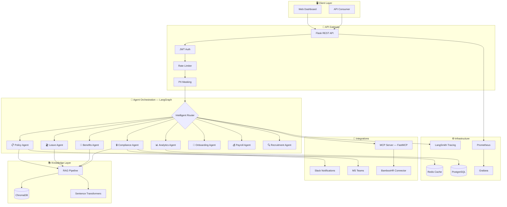

<div align="center">

# 🤖 HR Intelligence Platform

**Enterprise-Grade Multi-Agent AI System for Autonomous HR Operations**

[](https://python.org)
[](https://langchain-ai.github.io/langgraph/)
[](#testing)
[](LICENSE)
[](https://hr-platform-1054475963653.us-central1.run.app/dashboard)

[Live Demo](https://hr-platform-1054475963653.us-central1.run.app/dashboard) · [Architecture](#architecture) · [Quick Start](#quick-start)

[📖 Full Case Study](https://aidenmak.com/hr-intelligence.html)


</div>

---

## Why This Project?

Most HR "AI" tools are just chatbots with a knowledge base. This platform is different — it orchestrates **8 specialized AI agents** that autonomously handle complex, multi-step HR workflows end-to-end: from answering policy questions to processing leave requests, enrolling benefits, auditing compliance, and generating workforce analytics.

Built as an enterprise-grade system with **MCP integration**, **RAG-powered knowledge retrieval**, **PII protection**, and **production observability** — then hardened with **1,909 tests** and deployed on GCP Cloud Run.

### Key Numbers

| Metric | Value |
|--------|-------|
| 🤖 Specialized Agents | **8** (policy, leave, benefits, compliance, analytics, onboarding, payroll, recruitment) |
| 🔧 MCP Tools | **28** tools, **8** resources, **5** prompts via FastMCP |
| 🧪 Test Coverage | **1,909** tests (Pytest unit/integration + Playwright E2E) |
| 📦 Python Modules | **101** across the platform |
| ☁️ Deployment | **GCP Cloud Run** with CI/CD pipeline |

---

## Feature Showcase

### Core HR operations — what an HR team actually buys

<details>
<summary><b>🗓️ Leave Management</b> — calendar request → confirm → approval flow, end-to-end</summary>
<br>


Balance cards answer "how many days do I have left?" on page load. Pick a range on the
calendar, confirm a summary of exactly what you're requesting, and watch it appear in
history as <i>Pending</i> while your manager is notified.
</details>

<details>
<summary><b>✅ Approval Workflows</b> — managers act in one place, every decision logged</summary>
<br>


Every pending request lands in a single queue with approve/reject actions; the workflow
timeline updates the moment a decision is made.
</details>

<details>
<summary><b>👥 Employee Directory</b> — live search, Grid / List / Org Chart views</summary>
<br>


Reads from the same live database everything else runs on — never out of date by
construction. Search filters as you type across name, department, role and email.
</details>

<details>
<summary><b>📁 Document Center</b> — drag-drop upload + template-based generation</summary>
<br>


Upload with progress and validation, or generate employment certificates, offer letters
and salary slips from templates filled with the employee's actual record.
</details>

<details>
<summary><b>📊 Analytics & Reporting</b> — workforce metrics, one-click CSV/PDF export</summary>
<br>


Headcount, leave usage, query volume and agent activity — filterable by department and
date range, exportable for the boardroom.
</details>

### The AI layer — what makes it feel effortless

<details open>
<summary><b>💬 Conversational self-service</b> — ask in plain language, get a grounded answer</summary>
<br>


Note the <b>LEAVE AGENT</b> badge, the confidence score and the <i>View Reasoning</i>
button — because behind the chat box, this is not one chatbot.
</details>

<details>
<summary><b>🧭 Multi-Agent Orchestration</b> — three questions, three different specialists</summary>
<br>


A router classifies each question and dispatches to one of 8 domain agents — watch the
badge change from LEAVE to BENEFITS to POLICY across one conversation.
</details>

<details>
<summary><b>📚 RAG Policy Q&A</b> — answers cite your policy documents, with source chips</summary>
<br>


Asked how long personnel files are kept after resignation, the platform answers with the
company's actual 7-year retention rule, cites <i>gdpr_policy.txt Section 10</i> inline,
and renders every retrieved document as a source chip.
</details>

<details>
<summary><b>🛡️ PII Protection</b> — sensitive data masked on screen, GDPR/CCPA aware</summary>
<br>


A message containing an SSN, phone number and personal email comes back masked —
<code>[SSN REDACTED]</code>, <code>[PHONE NUMBER REDACTED]</code> — with the relevant
GDPR and CCPA articles cited.
</details>

> 🎬 All clips are recorded with a scripted Playwright recorder (`scripts/record_showcase.js`)
> against the live app — regeneration steps in [`docs/showcase/media/README.md`](docs/showcase/media/README.md).

---

## Architecture



### How It Works

1. **Request enters** → Flask API with JWT auth, rate limiting, and automatic PII detection/masking
2. **Intelligent routing** → LangGraph orchestrator analyzes intent and delegates to the right specialized agent
3. **Agent executes** → Each agent has its own tools, knowledge access (via RAG), and decision logic
4. **MCP integration** → 28 tools exposed via FastMCP for external system interoperability (BambooHR, etc.)
5. **Response returned** → With full observability traced through LangSmith, Prometheus, and Grafana

---

## Tech Stack

| Layer | Technologies |
|-------|-------------|
| **AI/ML** | LangGraph 0.2, OpenAI GPT-4, Gemini (fallback), ChromaDB, Sentence Transformers |
| **Backend** | Python 3.10+, Flask 3.0, SQLAlchemy 2.0, Celery |
| **MCP** | FastMCP — 28 tools, 8 resources, 5 prompts |
| **Data** | PostgreSQL 15+, Redis 7+, ChromaDB |
| **Frontend** | HTML/CSS/JS, Jinja2, Chart.js |
| **Infrastructure** | Docker, GCP Cloud Run, Nginx, CI/CD |
| **Observability** | Prometheus, Grafana, LangSmith |
| **Testing** | Pytest (1,909 tests), Playwright E2E |
| **Compliance** | GDPR, CCPA, HIPAA frameworks |

---

## Project Structure

```
HR-Intelligence-platform/
├── src/
│   ├── agents/              # 8 specialized LangGraph agents
│   │   ├── policy_agent.py
│   │   ├── leave_agent.py
│   │   ├── benefits_agent.py
│   │   ├── compliance_agent.py
│   │   ├── analytics_agent.py
│   │   ├── onboarding_agent.py
│   │   ├── payroll_agent.py
│   │   └── recruitment_agent.py
│   ├── api/                 # REST API routes & middleware
│   ├── core/                # RAG pipeline, LLM gateway, compliance engine
│   ├── connectors/          # HRIS integrations (BambooHR, Workday)
│   ├── mcp/                 # FastMCP server — tools, resources, prompts
│   ├── middleware/           # Rate limiting, PII masking, JWT auth
│   └── services/            # Business logic & orchestration
├── frontend/                # Web UI (templates + static assets)
├── tests/                   # 1,909 tests (unit, integration, E2E)
├── deploy/                  # Docker, GCP Cloud Run configs
├── docs/                    # Architecture & API documentation
└── docker-compose.yml
```

---

## Quick Start

### Prerequisites

- Python 3.10+
- Docker & Docker Compose
- OpenAI API key

### Run with Docker (recommended)

```bash
# Clone
git clone https://github.com/aidenmak0624/HR-Intelligence-platform.git
cd HR-Intelligence-platform

# Configure environment
cp .env.example .env
# Add your OPENAI_API_KEY to .env

# Start all services
docker-compose up -d

# Access the dashboard
open http://localhost:5050/dashboard
```

**Demo credentials:** `admin@company.com` / `admin123`

### Run locally

```bash
# Install dependencies
pip install -r requirements.txt

# Set up database
flask db upgrade

# Start the application
python run.py
```

---

## Testing

The platform is backed by **1,909 tests** across multiple testing layers:

```bash
# Run full test suite
pytest

# Run with coverage
pytest --cov=src --cov-report=html

# Run E2E tests
playwright install
pytest tests/e2e/
```

| Test Type | Count | What It Covers |
|-----------|-------|----------------|
| Unit | ~1,400 | Agent logic, RAG pipeline, PII detection, compliance rules |
| Integration | ~350 | API endpoints, database operations, MCP tool execution |
| E2E | ~159 | Full user flows via Playwright browser automation |

---

## MCP Integration

The platform exposes an MCP server via **FastMCP** for interoperability with external AI systems:

```python
# Connect to the HR Intelligence Platform MCP server
from fastmcp import Client

async with Client("hr-agent-mcp") as client:
    # List available tools
    tools = await client.list_tools()  # 28 tools

    # Execute a tool
    result = await client.call_tool(
        "get_leave_balance",
        {"employee_id": "EMP001"}
    )
```

**28 tools** across HR domains: leave management, benefits enrollment, policy queries, compliance checks, analytics reporting, and more.

---

## Development Approach

This project was built using an **AI-assisted "vibe coding" methodology** — leveraging Claude Code for architecture and backend, GitHub Copilot for in-editor assistance, Figma for UI design, and Antigravity for manual QA validation. Every AI-generated component was then hardened through rigorous testing (1,909 tests) and production deployment.

📖 **[AI-assisted development process — verified by 1,909 automated tests →](https://aidenmak.com/hr-intelligence.html)**

---

## Live Demo

🔗 **[hr-platform-1054475963653.us-central1.run.app/dashboard](https://hr-platform-1054475963653.us-central1.run.app/dashboard)**

The platform is deployed on **Google Cloud Run** with:
- Automatic scaling and load balancing
- CI/CD pipeline for continuous deployment
- Prometheus + Grafana monitoring
- LangSmith tracing for agent observability

---

## License

This project is licensed under the MIT License — see the [LICENSE](LICENSE) file for details.

---

<div align="center">

**Built by [Aiden Mak](https://aidenmak.com)** · AI Engineer · Toronto

[](https://aidenmak.com)
[](https://linkedin.com/in/mcwaiden)
[](mailto:mcwaiden000@gmail.com)

</div>
